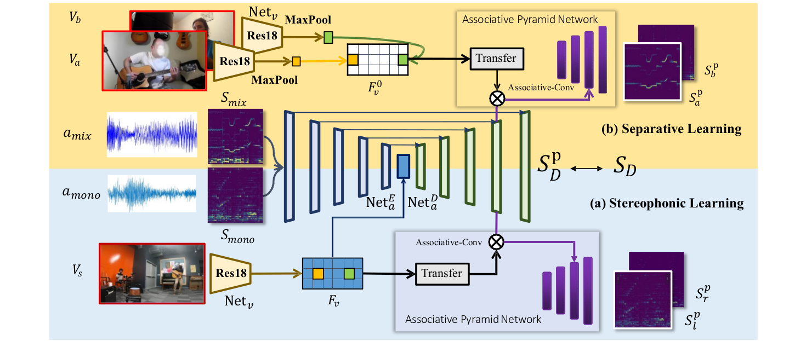

# Sep-Stereo: Visually Guided Stereophonic Audio Generation by Associating Source Separation (ECCV 2020)

We propose to integrate the task of stereophonic audio generation and audio source separation into a unified framework namely **Sep-Stereo**, which leverages vastly available mono audios to facilitate the training of stereophonic audio generation. Moreover, we design Associative Pyramid Network (APNet) which better associates the visual features and the audio features with a learned Associative-Conv operation, leading to performance improvement in both two tasks. 

[[Project]](https://hangz-nju-cuhk.github.io/projects/Sep-Stereo) [[Paper]](https://hangz-nju-cuhk.github.io/projects/Sep-Stereo) [[Demo]](https://www.youtube.com/watch?v=njn7ctayUcI)



## Requirements
* Python 3.6 is used. Basic requirements are listed in the 'requirements.txt'
```
pip install -r requirements.txt 
```

## Dataset

### Stereo dataset
**FAIR-Play** can be accessed [here](https://github.com/facebookresearch/FAIR-Play).
**YT-Music** can be accessed [here](https://github.com/pedro-morgado/spatialaudiogen).

### Separation dataset
**MUSIC21** can be accessed [here](https://github.com/roudimit/MUSIC_dataset).
As illustrated in our supplementary material, you'd better choose those instrument categories presented in the stereo dataset, such as cello, trumpet, piano, etc.

## Training and Testing

All the training and testing bash scripts can be found in *'./scripts'*. Before training, please prepare stereo data as the instructions in [**FAIR-Play**](https://github.com/facebookresearch/FAIR-Play). For **MUSIC21** dataset, please the videos into 10s clips and formulate the data split as *'./data/dummy_MUSIC_split'*.

## License and Citation
The usage of this software is under [CC-BY-4.0](https://github.com/SheldonTsui/SepStereo_ECCV2020/blob/master/LICENSE).
```
@inproceedings{zhou2020sep,
  title={Sep-Stereo: Visually Guided Stereophonic Audio Generation by Associating Source Separation},
  author={Zhou, Hang and Xu, Xudong and Lin, Dahua and Wang, Xiaogang and  Liu, Ziwei},
  booktitle={Proceedings of the European Conference on Computer Vision (ECCV)},
  year={2020}
}
```

## Acknowledgement
The structure of this codebase is borrowed from [2.5D Visual Sound](https://github.com/facebookresearch/2.5D-Visual-Sound).
